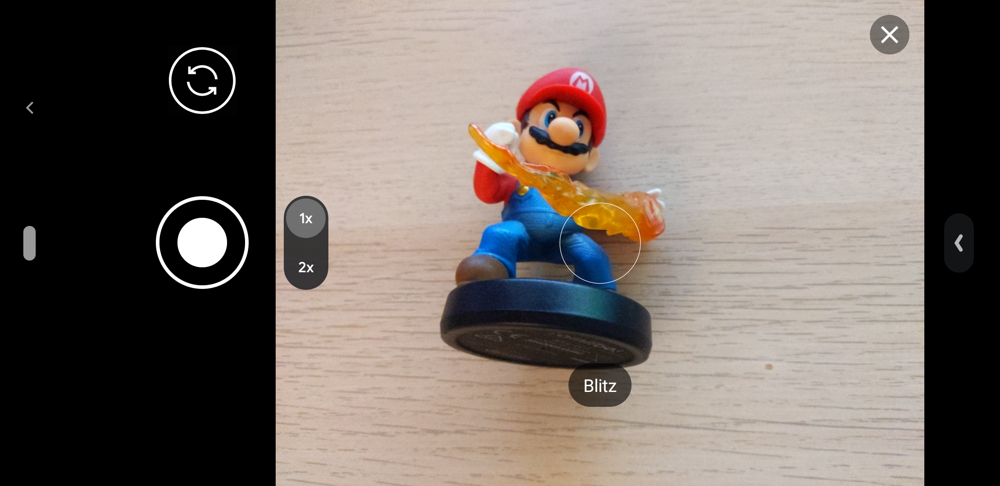

# Capacitor Camera Orientation Issue Reproduction Repo

Project to reproduce Issue ["Camera - android - Image has wrong orientation"](https://github.com/ionic-team/capacitor-plugins/issues/503)

```
npm install
npm build
npx cap run android
```

## Possible workarounds
- Set `correctOrientation: false` or
- use css attribute `image-orientation: none` on `` element

## Screenshots
### Taking portrait picture


### Taking landscape picture


